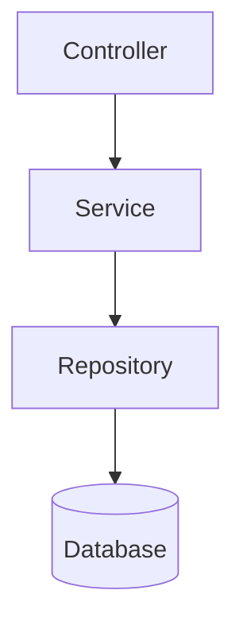

# Student Management API

A simple Spring Boot REST API for managing student records.  
It provides CRUD operations with a clean layered architecture: Controller → Service → Repository → Database.  
The project includes configuration for initial data and sample HTTP requests for testing.

---

## Features
- Create, Read, Update, and Delete (CRUD) student records  
- RESTful endpoints using Spring Web  
- Data persistence with Spring Data JPA  
- Preloaded student data via configuration  
- Example HTTP requests for quick testing  

---

## Project Structure
```
src/
 ├── DemoApplication.java       # Application entry point
 ├── student.java               # JPA entity (Student model)
 ├── studentController.java     # REST endpoints
 ├── studentService.java        # Business logic
 ├── studentRepository.java     # Database access
 ├── studentConfig.java         # Data initialization
 └── generated-requests.http    # Example API requests
```

---

## Requirements
- Java 17+  
- Maven 3+  
- A database (H2, MySQL, or Postgres depending on your configuration)  

---

## Getting Started

### 1. Clone the Repository
```bash
git clone https://github.com/your-username/student-management-api.git
cd student-management-api
```

### 2. Build the Project
```bash
mvn clean install
```

### 3. Run the Application
```bash
mvn spring-boot:run
```

The app will start at:  
```
http://localhost:8080/api/v1/student
```

---

## API Endpoints

| Method | Endpoint              | Description                  |
|--------|-----------------------|------------------------------|
| GET    | `/students`           | Get all students             |
| GET    | `/students/{id}`      | Get a student by ID          |
| POST   | `/students`           | Create a new student         |
| PUT    | `/students/{id}`      | Update a student by ID       |
| DELETE | `/students/{id}`      | Delete a student by ID       |

---

## Example Request (from `generated-requests.http`)
```http
### Get all students
GET http://localhost:8080/api/v1/student

### Create a new student
POST http://localhost:8080/api/v1/student
Content-Type: application/json

{
  "name": "John Doe",
  "email": "john.doe@example.com",
  "age": 22
}
```

---

## Architecture Diagram


---

## Future Improvements
- Add input validation  
- Integrate Swagger for API documentation  
- Implement pagination and search  
- Add authentication & authorization  
